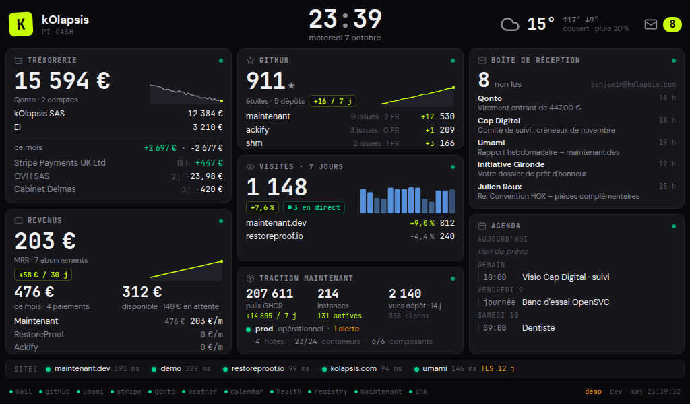

# pi-dashboard

A personal desk dashboard for a Raspberry Pi 5 with a 7" 1024×600 HDMI screen. One static Go binary polls the services a founder looks at every day and renders a dense, dark, French-language kiosk page in Chromium.



## What it shows

| Tile | Source | Data |
|---|---|---|
| Trésorerie | Qonto Business API (N organisations) | balances per account, month in/out, last movements, 30-day sparkline |
| Revenus | Stripe (N accounts, restricted keys) | MRR, month net revenue, payments, last payment, available/pending balance |
| GitHub | GitHub REST API | stars per repository, +7 d delta, 30-day sparkline, open issues/PRs, traffic |
| Visites | self-hosted Umami (v2 or v3) | visits over 7 days, delta vs previous week, 14-day bars, live visitors |
| Traction Maintenant | GHCR package page, Docker Hub, SHM metrics, Maintenant status page | pulls, instances, repo views/clones, instance health |
| Boîte de réception | Gmail over IMAP (app password) | unread count, latest unread messages |
| Agenda | any iCal feed (Google Calendar secret address) | today's events, next days, recurring events expanded |
| Top bar | Open-Meteo | current weather, min/max, rain probability |
| Sites | HTTP checks | status, latency, TLS expiry |

Every tile keeps its last good values when a source fails and says how old they are. The screen dims at night.

## How it works

```
collectors ──▶ scheduler ──▶ snapshot ──▶ GET /api/state
  (Go)         (interval,     (JSON)       GET /api/events (SSE)
               jitter,                     GET /  (embedded HTML/CSS/JS)
               backoff)
                  │
                  └──▶ SQLite history (sparklines, deltas), snapshot.json (warm start)
```

- `internal/collector/*`: one package per source, plain `net/http`, no SDKs.
- `internal/sched`: one goroutine per collector, exponential backoff, `ok` / `stale` / `error` states.
- `internal/store`: pure-Go SQLite (`modernc.org/sqlite`), so the binary cross-compiles with `CGO_ENABLED=0`.
- `internal/web`: the page, embedded in the binary. No build step, no framework.
- `pi/`: cloud-init provisioning for Raspberry Pi OS Lite (Trixie) and the labwc + Chromium kiosk. See [pi/README.md](pi/README.md).

## Quick start

```sh
make run            # demo mode with generated data on http://127.0.0.1:8080
make check          # vet, lint, tests, CGO check
```

`pi-dashboard serve --demo --demo-fail=stripe --demo-stale=qonto` shows the degraded states. Add `?night=1` or `?night=0` to the URL to force night mode on or off.

## Configuration

One YAML file, `/etc/pi-dashboard/config.yaml` (mode 0600). Start from [config.example.yaml](config.example.yaml). Removing a section disables its collector; unknown keys are rejected. Intervals accept Go durations (`60s`, `5m`, `1h`), minimum 30 s.

Test every credential once with:

```sh
pi-dashboard doctor --config config.yaml           # OK/KO per source
pi-dashboard doctor --only umami,qonto --json      # with the collected data
```

### Credentials and minimal permissions

| Source | Where | Permissions |
|---|---|---|
| Gmail | Google Account → Security → 2-Step Verification → App passwords | IMAP enabled in Gmail settings; one app password named `pi-dashboard` |
| GitHub | Settings → Developer settings → Fine-grained tokens, resource owner = your organisation | `Metadata: read`; `Administration: read` for traffic; `Issues`/`Pull requests: read` for private repos |
| Umami | Settings → API keys (v3) | one key; on v2 use a *View only* user with `username`/`password` |
| Stripe | Developers → API keys → Create restricted key (live mode), one per account | Read on Balance, Charges, Subscriptions; optional Invoices, Checkout Sessions, Customers |
| Qonto | Settings → Integrations and Partnerships → API key, one per organisation | the key is `slug:secret`; Qonto has no scopes, treat it as full access |
| Google Calendar | Calendar settings → Integrate calendar → *Secret address in iCal format* | none |
| SHM | basic-auth credentials of the metrics endpoint | read |

Secrets never leave the Pi: the config is readable by root only and handed to the service through systemd `LoadCredential`.

## Build and deploy

```sh
make build-arm64                         # out/pi-dashboard_linux_arm64 + SHA256SUMS
make deploy HOST=pi-dash.local           # scp + install + restart
make deploy-config CONFIG_YAML=~/.config/pi-dashboard/config.yaml
make logs                                # journalctl -f on the Pi
```

Tags `v*` are built by GitHub Actions and published as a Release with the arm64 binary and its checksum; the Pi downloads that asset during provisioning.

## Provisioning a Pi

Flash Raspberry Pi OS Lite (64-bit, Trixie) with Raspberry Pi Imager, render the cloud-init files with your Wi-Fi, SSH key and config (`make boot-files`), copy them onto the boot partition, power on. The first boot installs labwc and Chromium, downloads the release binary, enables the services and reboots into the kiosk. Details, verification steps and troubleshooting: [pi/README.md](pi/README.md).

## License

MIT
